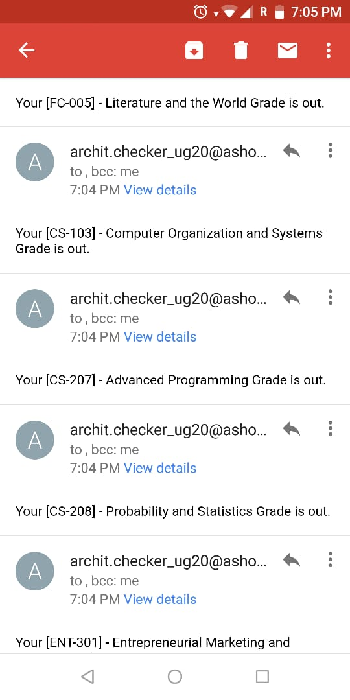

# GradeChecker
This is a short script that E-mails the user in real-time whenever a grade is posted on Ashoka LMS. This is a specific script for the Ashoka University LMS.

You need to type in your E-mail and number of courses. Also, the script sleeps for the initial 30 seconds so that you can login to your google account. Chromium Driver is required.

Python 2.7 and other dependencies, such as Selenium are required.

Usage: python checker.py

Example: 

  

